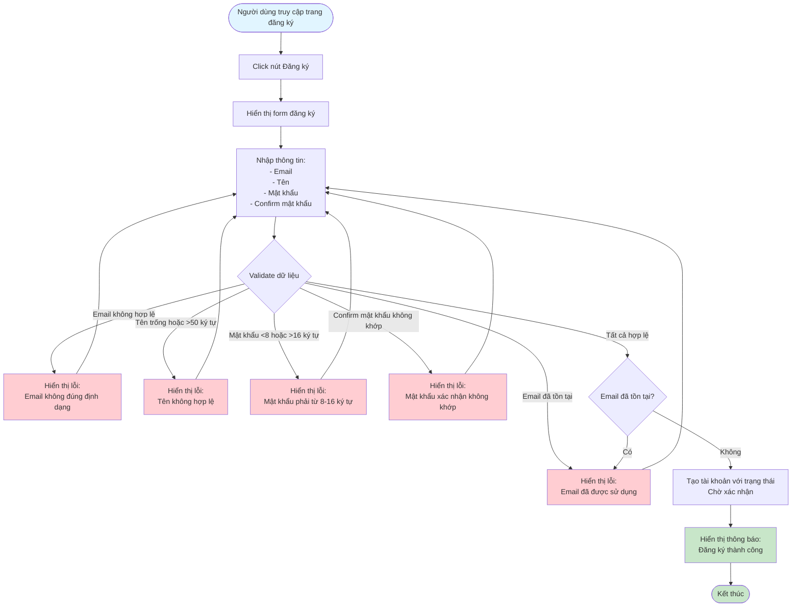

# 2.1.1 - Đăng Ký

## Mô tả
Tính năng cho phép người dùng mới đăng ký tài khoản trong hệ thống.

**Actor:** Mọi người  
**Yêu cầu:** Không có

## Flowchart

## Validation Rules
- **Email:** Định dạng email hợp lệ, không được trùng
- **Tên:** Không được để trống, tối đa 50 ký tự
- **Mật khẩu:** Không được để trống, tối thiểu 8 ký tự, tối đa 16 ký tự
- **Confirm mật khẩu:** Không được để trống, phải trùng với mật khẩu

## Edge Cases
- Email đã tồn tại trong hệ thống
- Mật khẩu và confirm mật khẩu không khớp
- Email không đúng định dạng
- Tên quá dài (>50 ký tự)
- Mật khẩu quá ngắn (<8 ký tự) hoặc quá dài (>16 ký tự)

