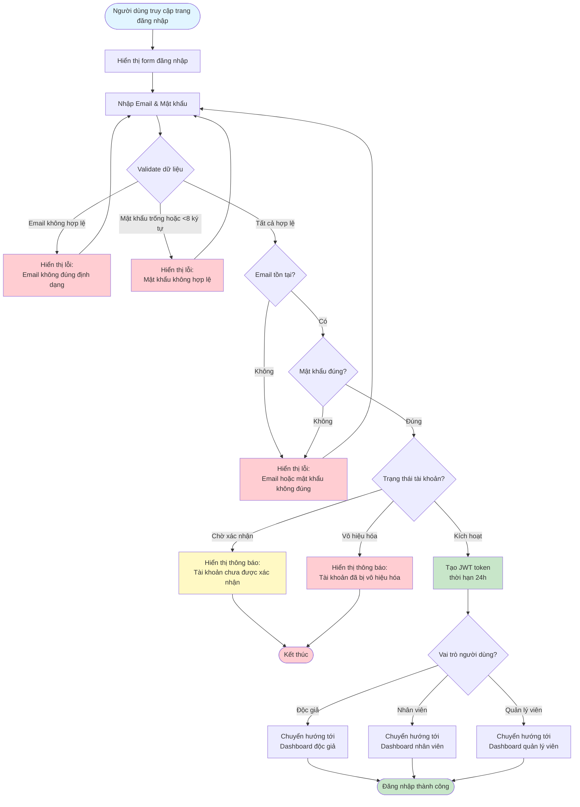

# 2.1.2 - Đăng Nhập (Login)

## Mô tả
Tính năng cho phép người dùng đăng nhập vào hệ thống bằng email và mật khẩu.

**Actor:** Mọi người  
**Yêu cầu:** Không có

## Flowchart

## Validation Rules
- **Email:** Định dạng email hợp lệ
- **Mật khẩu:** Không được để trống, tối thiểu 8 ký tự, tối đa 16 ký tự

## Edge Cases
- Email không tồn tại
- Mật khẩu sai
- Token hết hạn (sau 24h)
- Tài khoản chưa được xác nhận
- Tài khoản bị vô hiệu hóa
- Đăng nhập từ nhiều thiết bị

