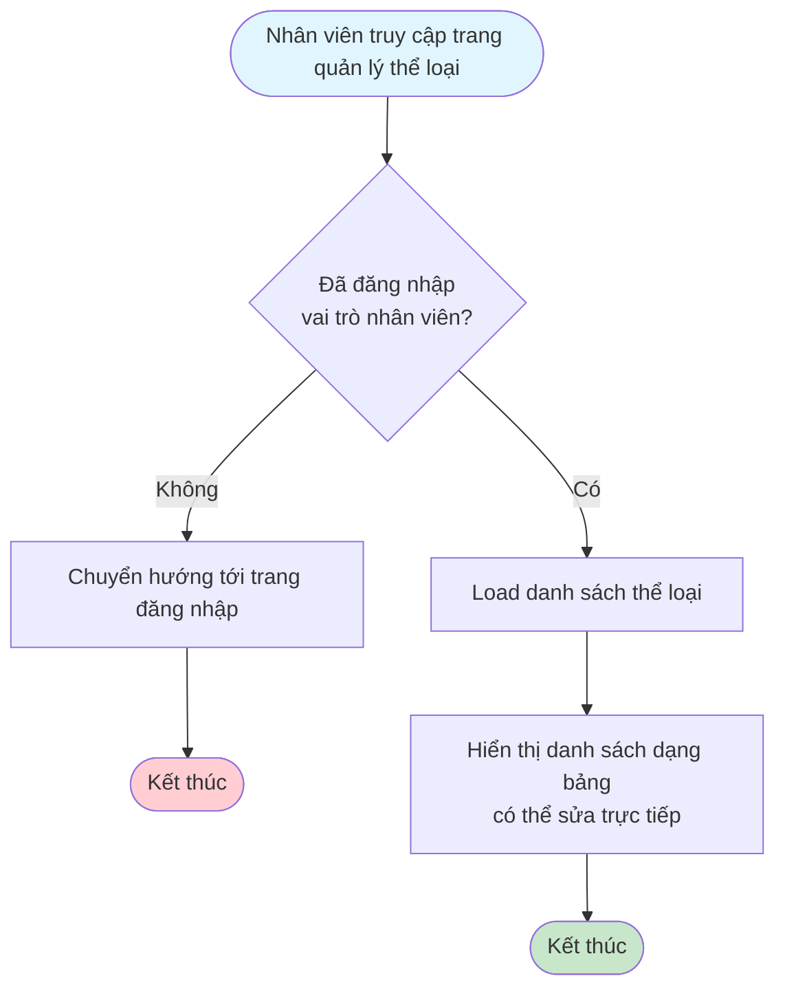
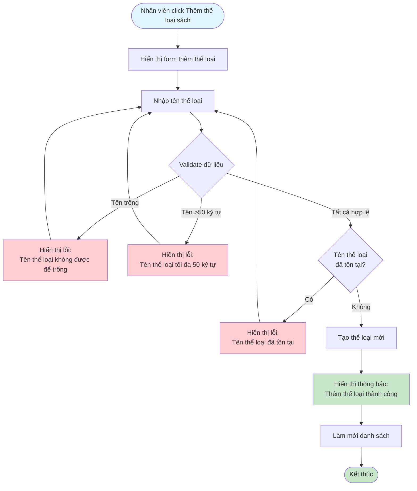
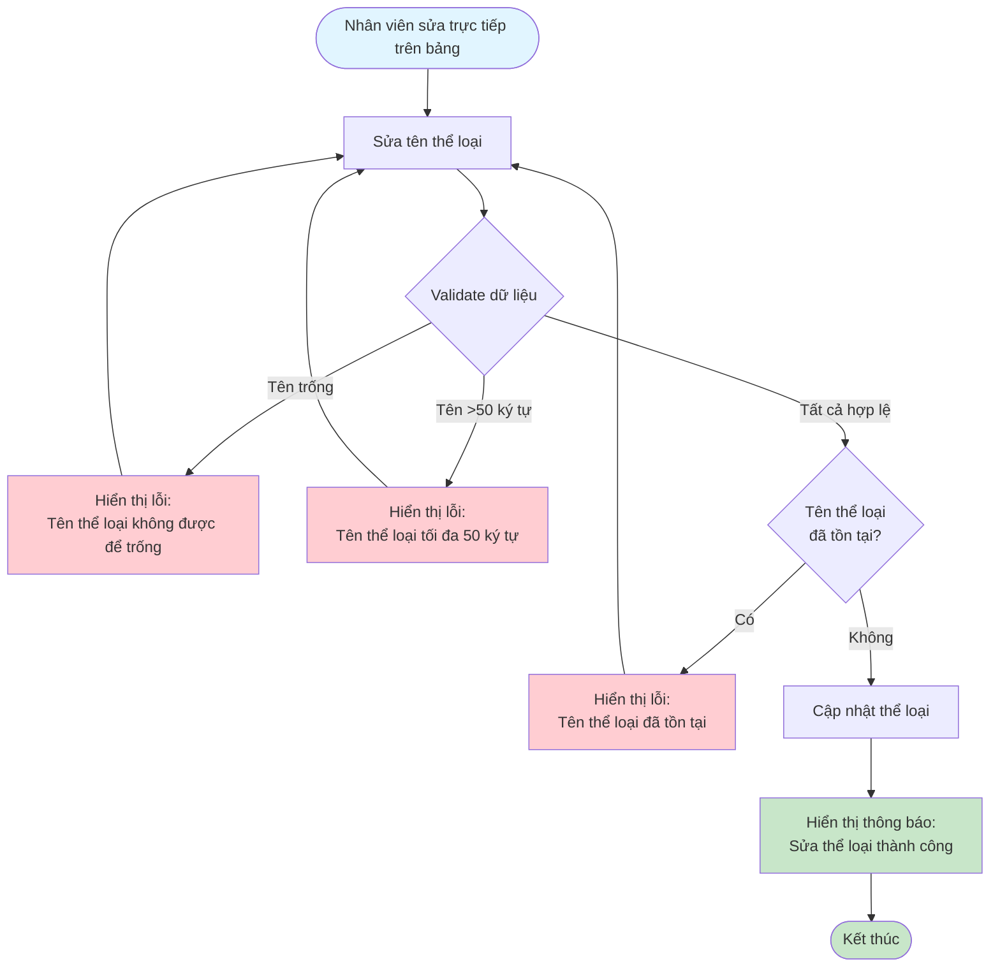
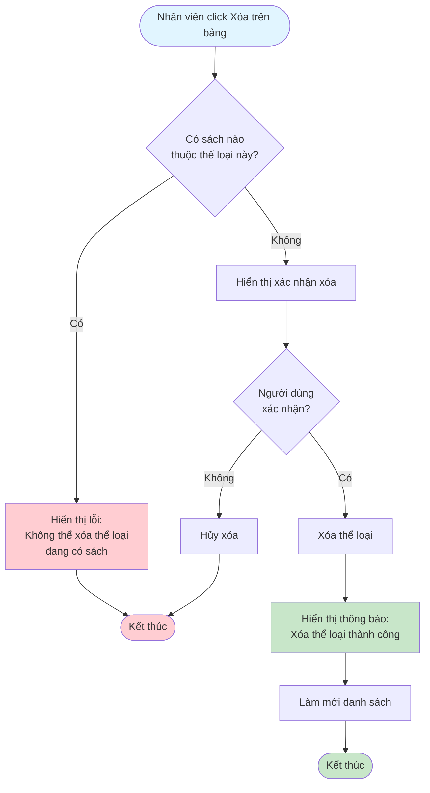

# 2.2.1 - Quản lý thể loại sách

## Mô tả
Tính năng cho phép nhân viên thư viện quản lý các thể loại sách: xem, thêm, sửa, xóa.

**Actor:** Nhân viên thư viện  
**Yêu cầu:** Đăng nhập với vai trò nhân viên

## Flowchart - Xem Danh Sách

## Flowchart - Thêm Thể Loại

## Flowchart - Sửa Thể Loại

## Flowchart - Xóa Thể Loại

## Validation Rules
- **Tên thể loại:** Không được để trống, tối đa 50 ký tự, không được trùng

## Edge Cases
- Tên thể loại quá dài (>50 ký tự)
- Tên thể loại trống
- Tên thể loại trùng với thể loại khác
- Xóa thể loại đang được sử dụng (có sách thuộc thể loại)

