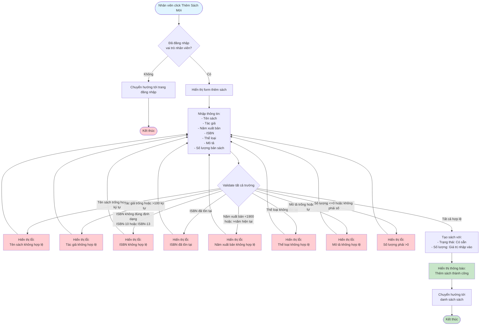

# 2.2.2 - Thêm Sách Mới

## Mô tả
Tính năng cho phép nhân viên thư viện thêm sách mới vào hệ thống.

**Actor:** Nhân viên thư viện  
**Yêu cầu:** Đăng nhập với vai trò nhân viên

## Flowchart

## Validation Rules
- **Tên sách:** Không được để trống, tối đa 100 ký tự
- **Tác giả:** Không được để trống, tối đa 100 ký tự
- **ISBN:** Định dạng chuẩn ISBN-10 hoặc ISBN-13 (nếu có), không được trùng
- **Số lượng:** Phải > 0, kiểu số
- **Năm xuất bản:** Năm hợp lệ (1900 - năm hiện tại)
- **Thể loại:** Phải có thể loại sách (tồn tại trong hệ thống)
- **Mô tả:** Không được để trống, tối đa 255 ký tự

## Edge Cases
- Tên sách quá dài (>100 ký tự)
- ISBN không đúng định dạng (ISBN-10 hoặc ISBN-13)
- ISBN đã tồn tại trong hệ thống
- Số lượng <= 0
- Năm xuất bản không hợp lệ (<1900 hoặc >năm hiện tại)
- Thể loại không tồn tại
- Mô tả quá dài (>255 ký tự)

