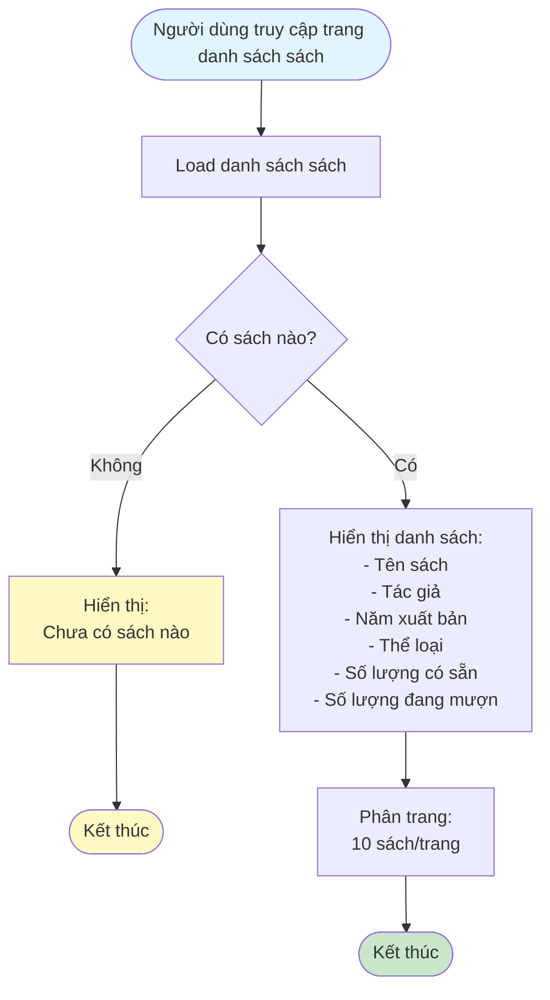
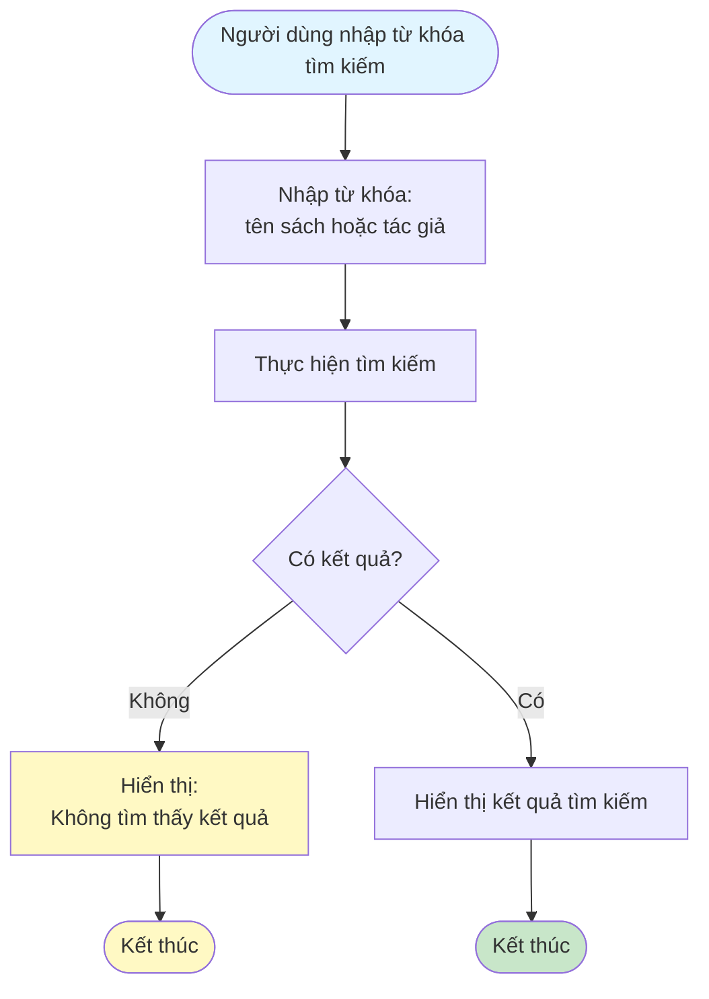
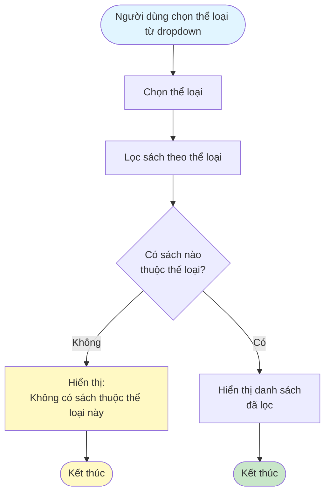
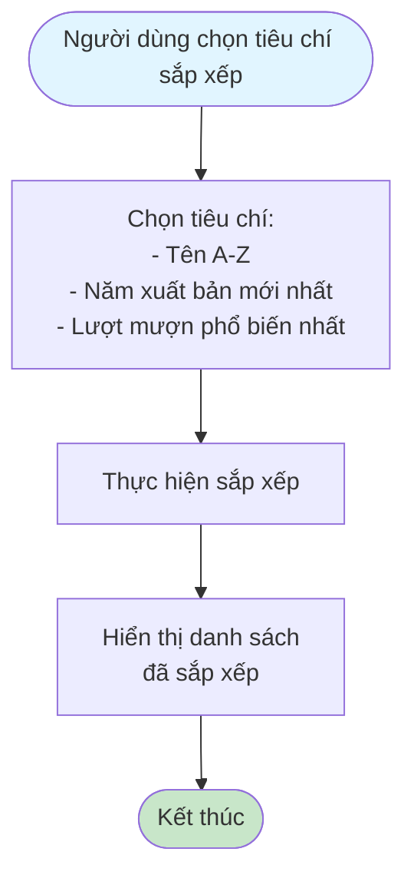
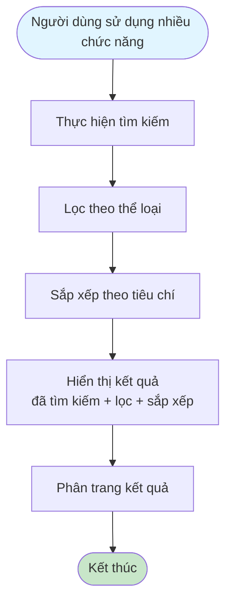

# 2.2.3 - Xem Danh Sách Sách

## Mô tả
Tính năng cho phép tất cả người dùng (không cần đăng nhập) xem danh sách sách với các chức năng tìm kiếm, lọc, sắp xếp.

**Actor:** Tất cả người dùng (không cần login)

## Flowchart - Xem Danh Sách

## Flowchart - Tìm Kiếm

## Flowchart - Lọc Theo Thể Loại

## Flowchart - Sắp Xếp

## Flowchart - Kết Hợp Tìm Kiếm + Lọc + Sắp Xếp

## Hiển Thị Thông Tin
- Tên sách
- Tác giả
- Năm xuất bản
- Thể loại
- Số lượng có sẵn
- Số lượng đang mượn

## Chức Năng
- **Tìm kiếm:** Theo tên sách hoặc tác giả
- **Lọc:** Theo thể loại
- **Sắp xếp:** 
  - Tên (A-Z)
  - Năm xuất bản (Mới nhất)
  - Lượt mượn (Phổ biến nhất)
- **Phân trang:** 10 sách trên 1 trang

## Edge Cases
- Không có kết quả tìm kiếm
- Danh sách rỗng
- Kết hợp tìm kiếm + lọc + sắp xếp
- Thể loại không có sách nào

