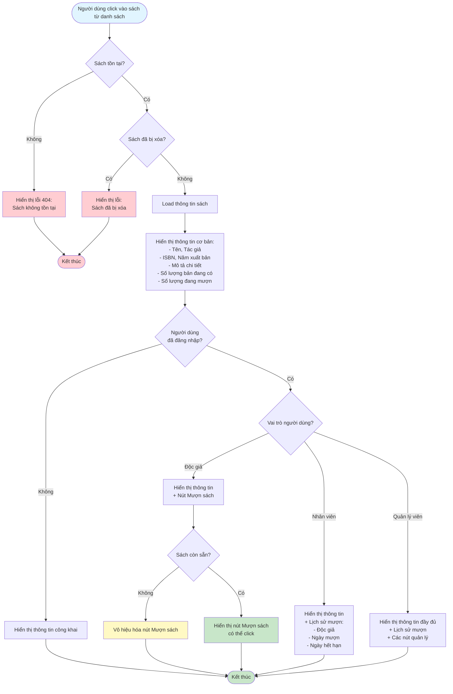

# 2.2.4 - Xem Chi Tiết Sách

## Mô tả
Tính năng cho phép tất cả người dùng (không cần đăng nhập) xem chi tiết thông tin của một cuốn sách.

**Actor:** Tất cả người dùng (không cần login)

## Flowchart

## Hiển Thị Thông Tin

### Tất cả người dùng:
- Tên sách
- Tác giả
- ISBN
- Năm xuất bản
- Mô tả chi tiết
- Số lượng bản đang có
- Số lượng đang mượn

### Nhân viên thư viện & Quản lý viên:
- Tất cả thông tin trên +
- Lịch sử mượn:
  - Độc giả
  - Ngày mượn
  - Ngày hết hạn

## Thao Tác

### Độc giả đã đăng nhập:
- Có thể nhấn "Mượn sách" (nếu sách còn sẵn)

### Nhân viên thư viện:
- Xem lịch sử mượn chi tiết

### Quản lý viên:
- Xem lịch sử mượn chi tiết
- Có thể truy cập các chức năng quản lý

## Edge Cases
- Sách không tồn tại (404)
- Sách đã bị xóa
- Sách không có sẵn (số lượng = 0)
- Độc giả chưa đăng nhập (không hiển thị nút "Mượn sách")
- Độc giả đã mượn sách này (cần kiểm tra trong luồng mượn sách)

