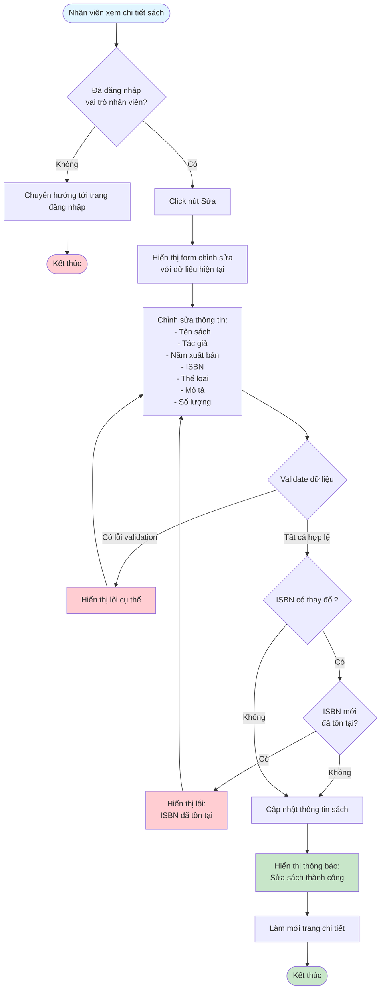
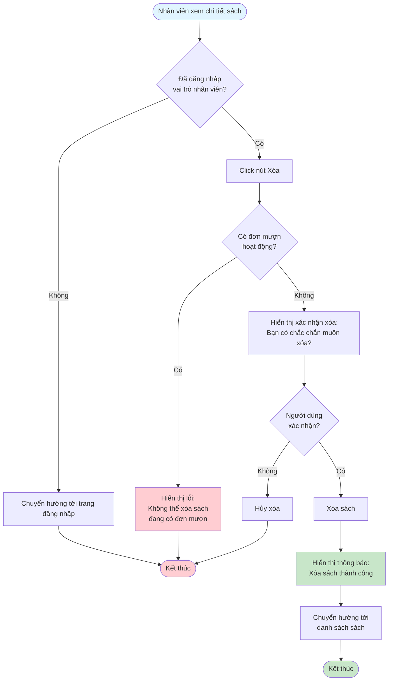

# 2.2.5 - Sửa & Xóa Sách

## Mô tả
Tính năng cho phép nhân viên thư viện sửa và xóa sách trong hệ thống.

**Actor:** Nhân viên thư viện  
**Yêu cầu:** Đăng nhập với vai trò nhân viên

## Flowchart - Sửa Sách

## Flowchart - Xóa Sách

## Validation Rules (Giống như thêm sách)
- **Tên sách:** Không được để trống, tối đa 100 ký tự
- **Tác giả:** Không được để trống, tối đa 100 ký tự
- **ISBN:** Định dạng chuẩn ISBN-10 hoặc ISBN-13 (nếu có), không được trùng với sách khác
- **Số lượng:** Phải > 0, kiểu số
- **Năm xuất bản:** Năm hợp lệ (1900 - năm hiện tại)
- **Thể loại:** Phải có thể loại sách (tồn tại trong hệ thống)
- **Mô tả:** Không được để trống, tối đa 255 ký tự

## Edge Cases
- Sách đang được mượn (có đơn mượn hoạt động) → Không thể xóa
- Sách có lịch sử mượn nhưng không có đơn hoạt động → Có thể xóa
- ISBN mới trùng với sách khác → Không thể cập nhật
- Số lượng sách đang mượn > số lượng mới → Cần xử lý logic

