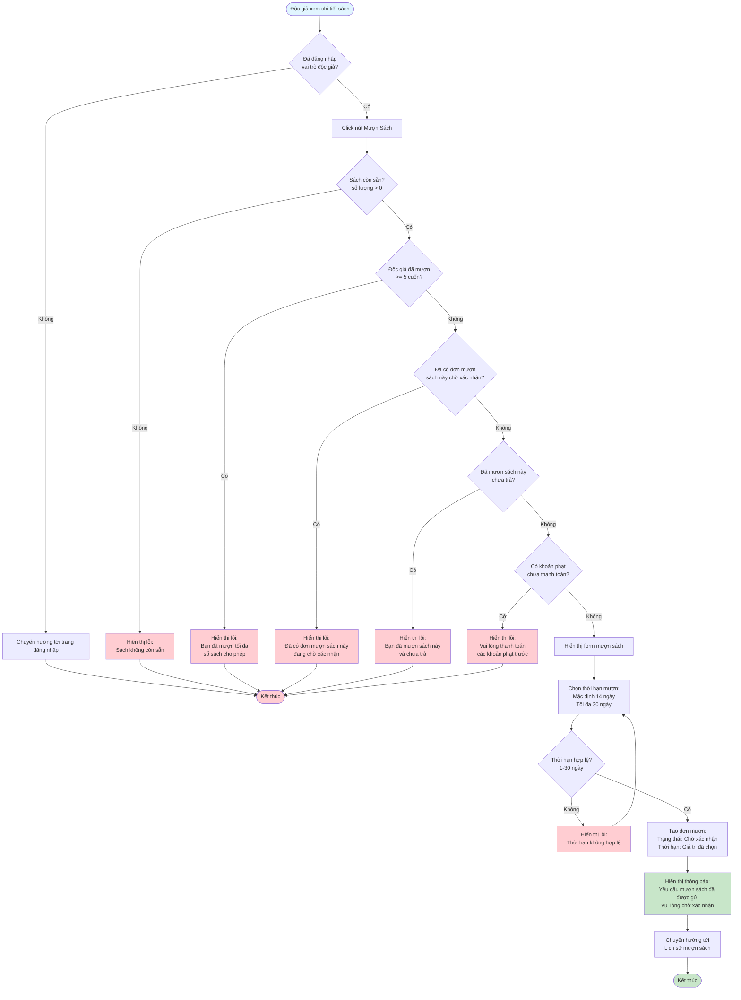

# 2.3.1 - Mượn Sách (Độc Giả)

## Mô tả
Tính năng cho phép độc giả yêu cầu mượn sách từ hệ thống.

**Actor:** Độc giả  
**Yêu cầu:** Đăng nhập với vai trò độc giả

## Flowchart

## Điều Kiện Mượn Sách
1. **Sách còn sẵn:** Số lượng sách có sẵn > 0
2. **Không vượt quá giới hạn:** Độc giả chưa mượn quá 5 cuốn sách
3. **Không có đơn mượn chờ xác nhận:** Chưa có đơn mượn sách này ở trạng thái "Chờ xác nhận"
4. **Chưa mượn sách này:** Chưa có đơn mượn sách này ở trạng thái "Đang mượn"
5. **Không có khoản phạt:** Không có khoản phạt chưa thanh toán

## Thời Hạn Mượn
- **Mặc định:** 14 ngày
- **Tối đa:** 30 ngày
- **Tối thiểu:** 1 ngày

## Edge Cases
- Sách không còn sẵn (số lượng = 0)
- Độc giả đã mượn quá 5 cuốn
- Độc giả đã mượn sách này trước đó (chưa trả)
- Độc giả có đơn mượn sách này đang chờ xác nhận
- Độc giả có khoản phạt chưa thanh toán
- Thời hạn mượn vượt quá 30 ngày
- Thời hạn mượn <= 0

