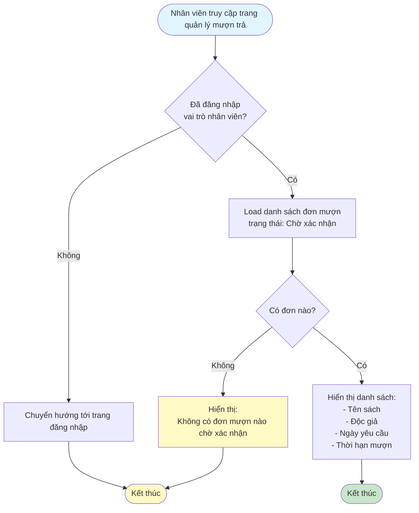
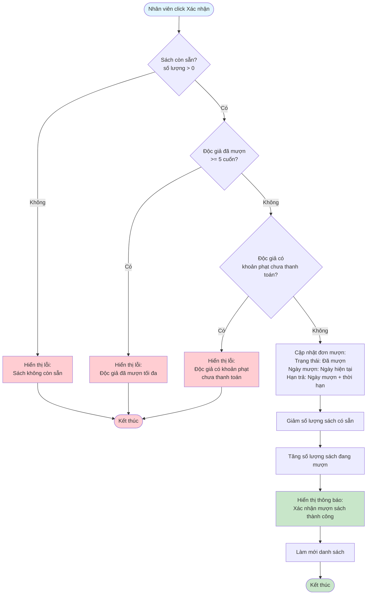
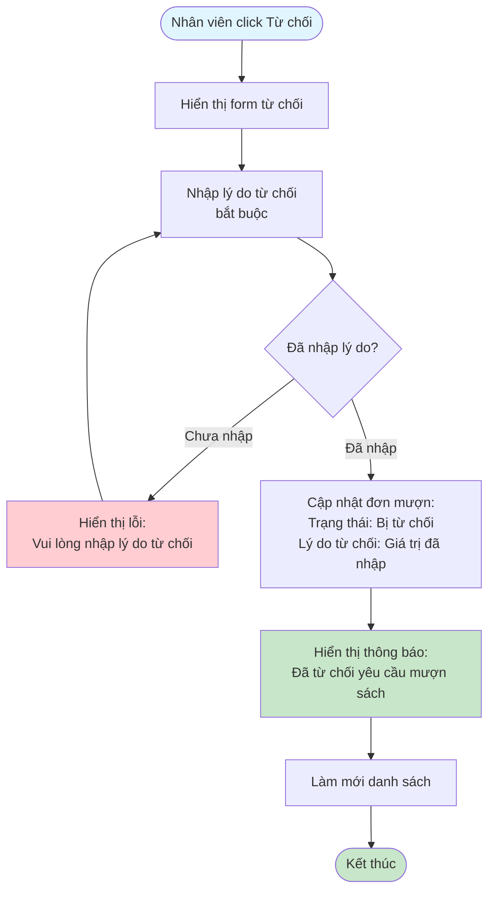

# 2.3.2 - Mượn Sách (Nhân Viên Thư Viện)

## Mô tả
Tính năng cho phép nhân viên thư viện xác nhận hoặc từ chối các yêu cầu mượn sách từ độc giả.

**Actor:** Nhân viên thư viện  
**Yêu cầu:** Đăng nhập với vai trò nhân viên

## Flowchart - Xem Danh Sách Chờ Xác Nhận

## Flowchart - Xác Nhận Mượn Sách

## Flowchart - Từ Chối Mượn Sách

## Validation Rules
- **Lý do từ chối:** Bắt buộc phải nhập

## Edge Cases
- Sách đã hết (số lượng = 0) khi xác nhận
- Độc giả đã mượn quá số lượng cho phép khi xác nhận
- Độc giả có khoản phạt khi xác nhận
- Lý do từ chối trống
- Đơn mượn không tồn tại hoặc đã được xử lý

