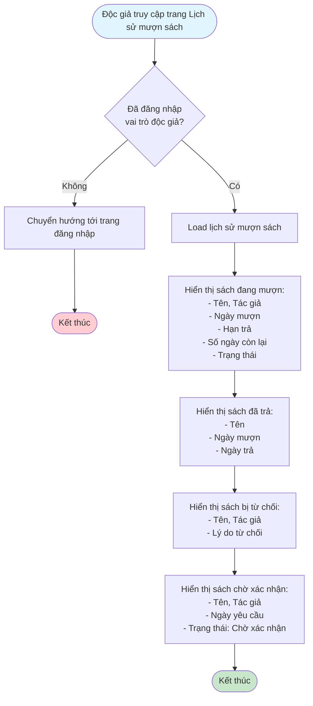
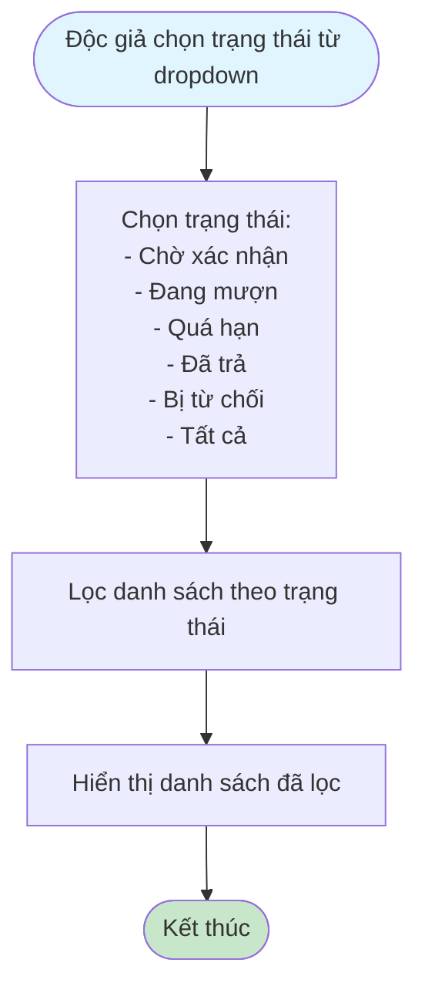
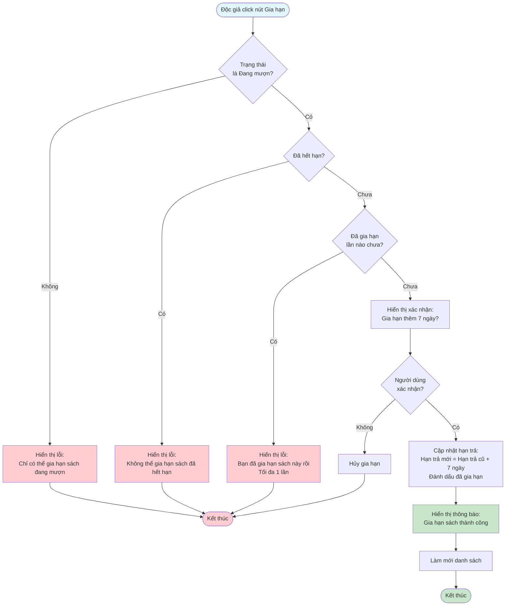
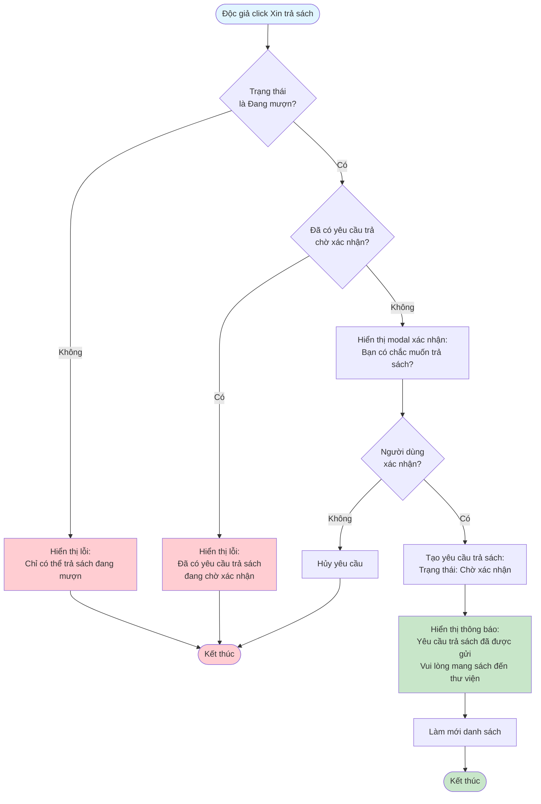

# 2.3.3 - Xem Lịch Sử Mượn Sách (Độc Giả)

## Mô tả
Tính năng cho phép độc giả xem lịch sử mượn sách, gia hạn sách và yêu cầu trả sách.

**Actor:** Độc giả  
**Yêu cầu:** Đăng nhập với vai trò độc giả

## Flowchart - Xem Lịch Sử

## Flowchart - Lọc Theo Trạng Thái

## Flowchart - Gia Hạn Sách

## Flowchart - Yêu Cầu Trả Sách

## Hiển Thị Thông Tin

### Sách đang mượn:
- Tên sách, Tác giả
- Ngày mượn
- Hạn trả
- Số ngày còn lại (hoặc số ngày quá hạn)
- Trạng thái: "Đang mượn" hoặc "Quá hạn"

### Sách đã trả:
- Tên sách
- Ngày mượn
- Ngày trả
- Trạng thái: "Đã trả"

### Sách bị từ chối:
- Tên sách, Tác giả
- Lý do từ chối
- Trạng thái: "Bị từ chối"

### Sách chờ xác nhận:
- Tên sách, Tác giả
- Ngày yêu cầu
- Trạng thái: "Chờ xác nhận"

## Chức Năng
- **Lọc:** Theo trạng thái
- **Gia hạn:** +7 ngày, tối đa 1 lần, chỉ khi chưa hết hạn
- **Yêu cầu trả sách:** Tạo yêu cầu trả sách cho sách đang mượn

## Edge Cases
- Sách quá hạn (hiển thị số ngày quá hạn)
- Đã gia hạn 1 lần (không cho gia hạn nữa)
- Đã có yêu cầu trả chờ xác nhận (không cho tạo yêu cầu mới)
- Xem lý do từ chối

