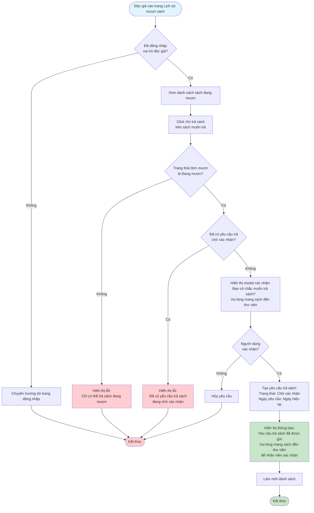

# 2.4.1 - Yêu Cầu Trả Sách

## Mô tả
Tính năng cho phép độc giả yêu cầu trả sách đang mượn.

**Actor:** Độc giả  
**Yêu cầu:** Đăng nhập với vai trò độc giả

## Flowchart

## Lưu Ý
- Độc giả cần mang sách đến thư viện để nhân viên xác nhận
- Một đơn mượn chỉ có thể tạo một yêu cầu trả ở trạng thái "Chờ xác nhận"
- Sau khi tạo yêu cầu trả, đơn mượn vẫn giữ trạng thái "Đang mượn" cho đến khi nhân viên xác nhận

## Edge Cases
- Sách không tồn tại trong danh sách đang mượn
- Đơn mượn không hợp lệ
- Đã có yêu cầu trả chờ xác nhận (không cho tạo yêu cầu mới)
- Đơn mượn không ở trạng thái "Đang mượn"

