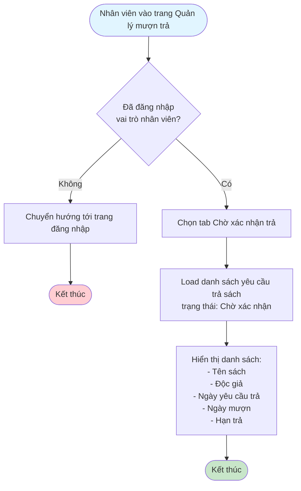
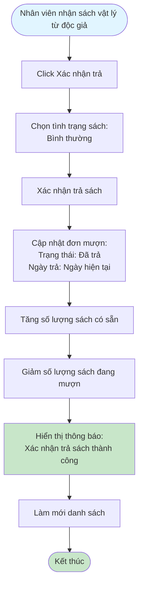
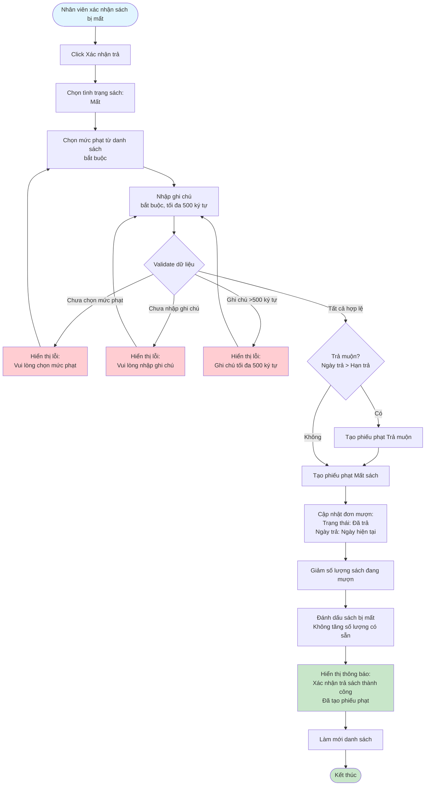

# 2.4.2 - Xác Nhận Trả Sách

## Mô tả
Tính năng cho phép nhân viên thư viện xác nhận trả sách và xử lý các trường hợp sách hư hỏng, mất, trả muộn.

**Actor:** Nhân viên thư viện  
**Yêu cầu:** Đăng nhập với vai trò nhân viên

## Flowchart - Xem Danh Sách Chờ Xác Nhận Trả

## Flowchart - Xác Nhận Trả Sách (Bình Thường)

## Flowchart - Xác Nhận Trả Sách (Hư Hỏng)

## Flowchart - Xác Nhận Trả Sách (Mất)

## Validation Rules
- **Tình trạng sách:** Bắt buộc chọn (bình thường, hư hỏng, mất)
- **Mức phạt:** Bắt buộc khi tình trạng là "hư hỏng", trả muộn hoặc "mất"
- **Ghi chú:** Bắt buộc khi tình trạng là "hư hỏng" hoặc "mất", tối đa 500 ký tự

## Edge Cases
- Sách vừa hư hỏng vừa trả muộn (tạo 2 phiếu phạt: Hư hỏng + Trả muộn)
- Sách vừa mất vừa trả muộn (tạo 2 phiếu phạt: Mất + Trả muộn)
- Không có mức phạt nào được cấu hình
- Chưa chọn tình trạng sách
- Chưa chọn mức phạt (khi hư hỏng/mất)
- Chưa nhập ghi chú (khi hư hỏng/mất)
- Ghi chú quá dài (>500 ký tự)

