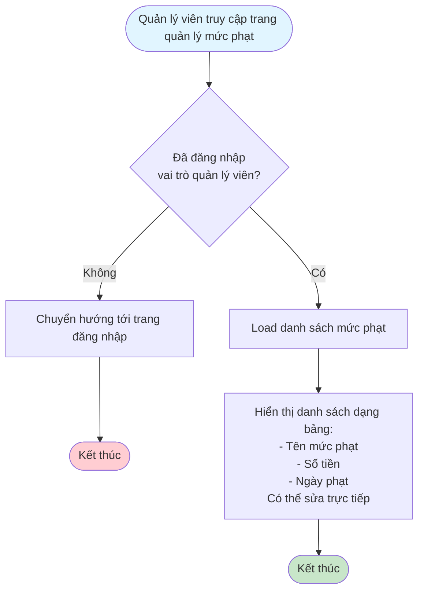
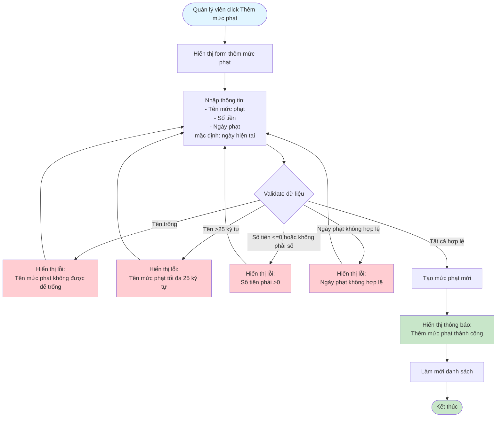
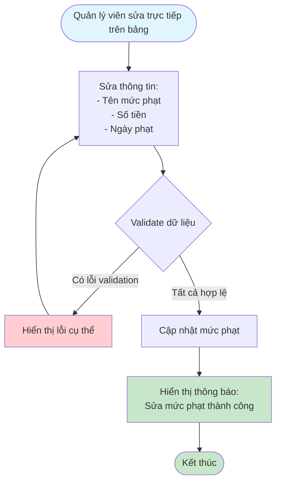
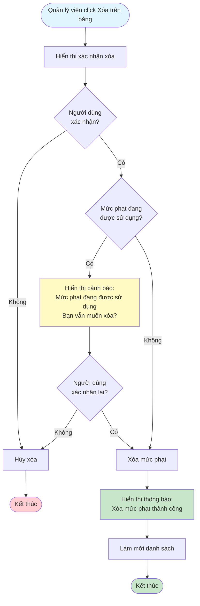

# 2.5.1 - Quản lý mức phạt

## Mô tả
Tính năng cho phép quản lý viên quản lý các mức phạt trong hệ thống: xem, thêm, sửa, xóa.

**Actor:** Quản lý viên  
**Yêu cầu:** Đăng nhập với vai trò quản lý viên

## Flowchart - Xem Danh Sách

## Flowchart - Thêm Mức Phạt

## Flowchart - Sửa Mức Phạt

## Flowchart - Xóa Mức Phạt

## Validation Rules
- **Tên mức phạt:** Không được để trống, tối đa 25 ký tự
- **Số tiền:** Phải > 0, kiểu số
- **Ngày phạt:** Ngày hợp lệ (mặc định là ngày hiện tại)

## Edge Cases
- Tên mức phạt quá dài (>25 ký tự)
- Số tiền <= 0
- Ngày phạt không hợp lệ
- Mức phạt đang được sử dụng trong phiếu phạt (có thể vẫn cho xóa nhưng cần cảnh báo)

