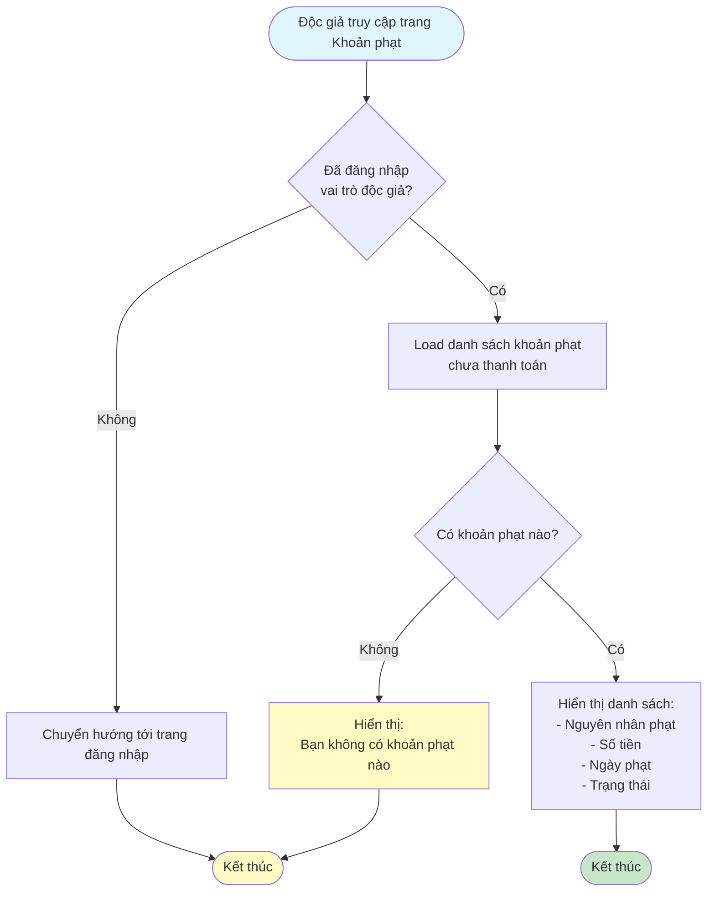
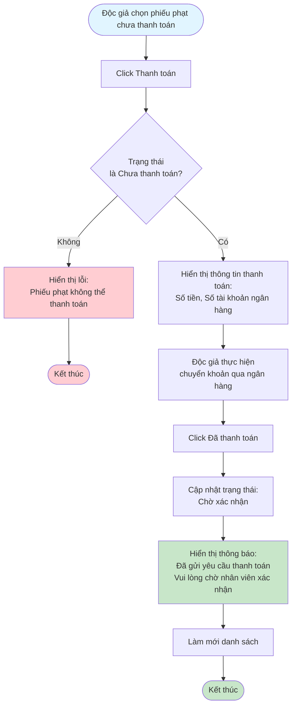

# 2.5.2 - Xem & Thanh Toán Khoản Phạt (Độc Giả)

## Mô tả
Tính năng cho phép độc giả xem và thanh toán các khoản phạt.

**Actor:** Độc giả  
**Yêu cầu:** Đăng nhập với vai trò độc giả

## Flowchart - Xem Danh Sách

## Flowchart - Thanh Toán

## Hiển Thị Thông Tin
- Danh sách khoản phạt chưa thanh toán
- Nguyên nhân phạt
- Số tiền
- Ngày phạt
- Trạng thái (Chưa thanh toán, Chờ xác nhận, Đã thanh toán, Từ chối)

## Edge Cases
- Không có khoản phạt
- Phiếu phạt đã được xác nhận
- Phiếu phạt bị từ chối (hiển thị lý do)
- Phiếu phạt ở trạng thái không hợp lệ

