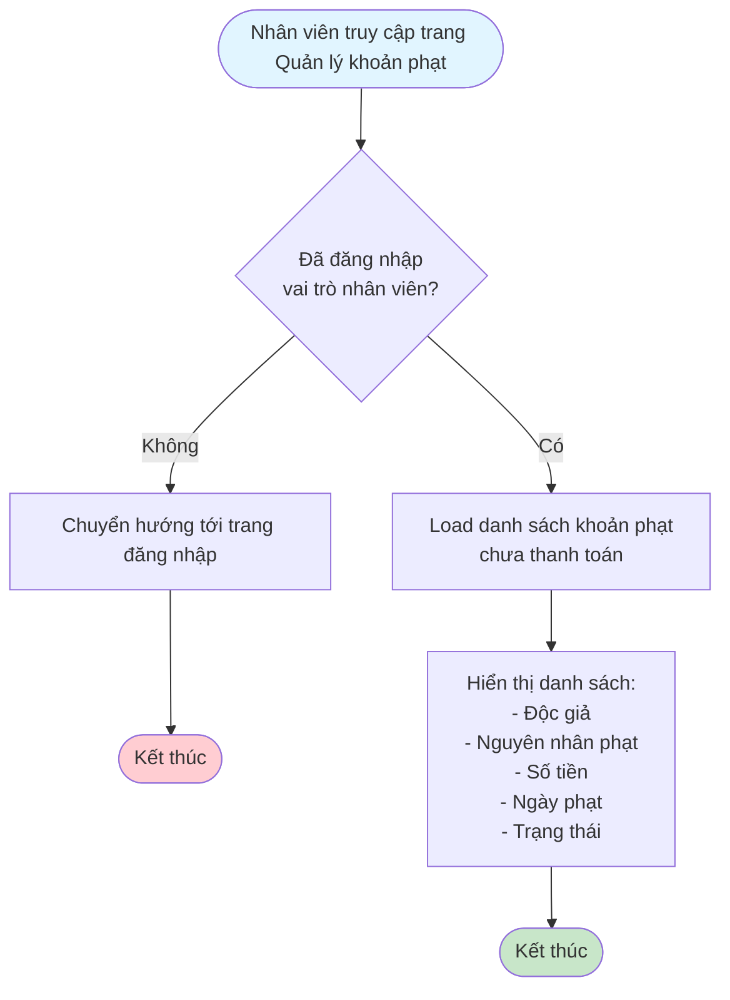
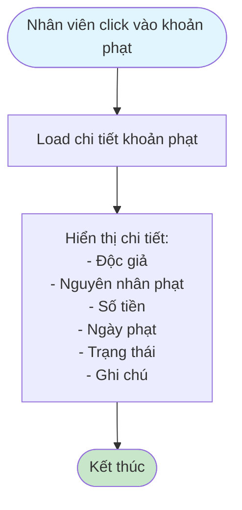
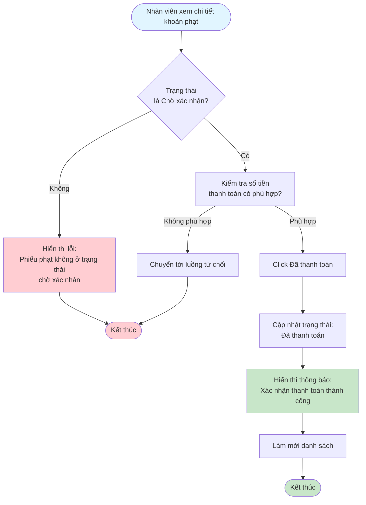
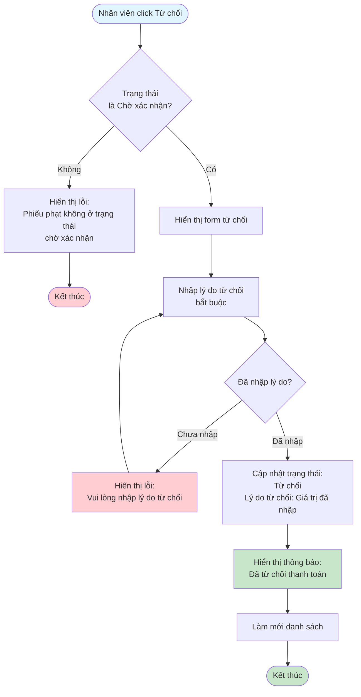

# 2.5.3 - Xem & Thanh Toán Khoản Phạt (Nhân Viên Thư Viện)

## Mô tả
Tính năng cho phép nhân viên thư viện xem và xác nhận/từ chối thanh toán khoản phạt từ độc giả.

**Actor:** Nhân viên thư viện  
**Yêu cầu:** Đăng nhập với vai trò nhân viên

## Flowchart - Xem Danh Sách

## Flowchart - Xem Chi Tiết

## Flowchart - Xác Nhận Thanh Toán

## Flowchart - Từ Chối Thanh Toán

## Validation Rules
- **Lý do từ chối:** Bắt buộc phải nhập

## Edge Cases
- Số tiền thanh toán không khớp với số tiền phạt
- Độc giả chưa thanh toán nhưng nhấn "Đã thanh toán"
- Lý do từ chối trống
- Phiếu phạt không ở trạng thái "Chờ xác nhận"

