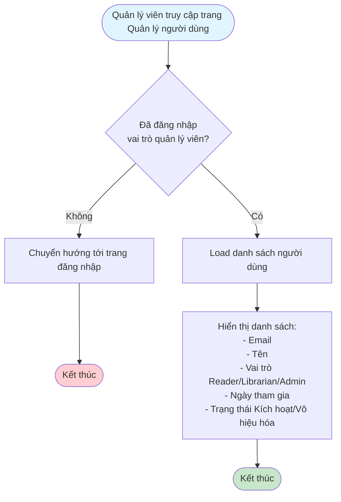
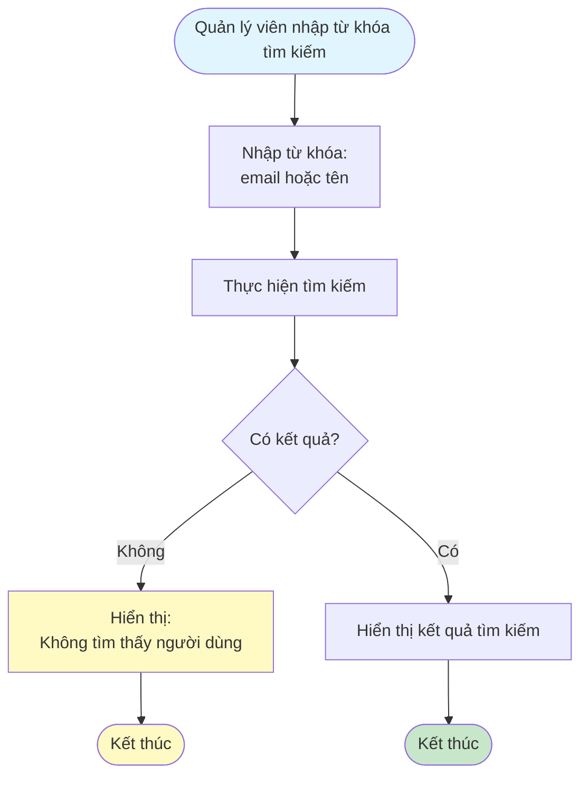
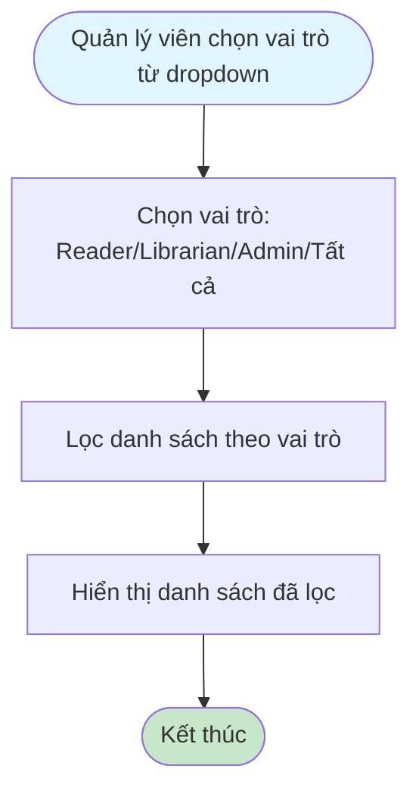
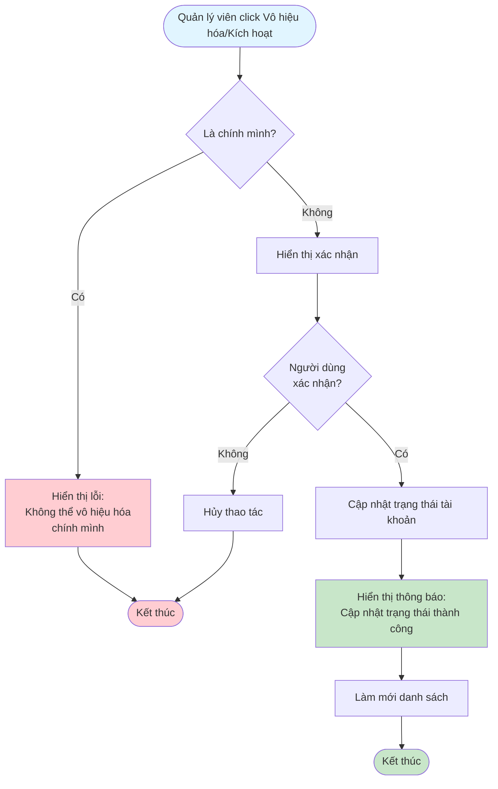

# 2.6.1 - Danh Sách Người Dùng

## Mô tả
Tính năng cho phép quản lý viên xem danh sách người dùng, tìm kiếm, lọc và quản lý trạng thái tài khoản.

**Actor:** Quản lý viên  
**Yêu cầu:** Đăng nhập với vai trò quản lý viên

## Flowchart - Xem Danh Sách

## Flowchart - Tìm Kiếm

## Flowchart - Lọc Theo Vai Trò

## Flowchart - Vô Hiệu Hóa/Kích Hoạt

## Hiển Thị Thông Tin
- Email
- Tên
- Vai trò (Reader/Librarian/Admin)
- Ngày tham gia
- Trạng thái (Kích hoạt/Vô hiệu hóa)

## Chức Năng
- **Tìm kiếm:** Theo email/tên
- **Lọc:** Theo vai trò
- **Vô hiệu hóa/Kích hoạt:** Tài khoản người dùng

## Edge Cases
- Không có kết quả tìm kiếm
- Tìm kiếm kết hợp với lọc
- Vô hiệu hóa chính mình (không cho phép)
- Vô hiệu hóa tài khoản đang có đơn mượn hoạt động

