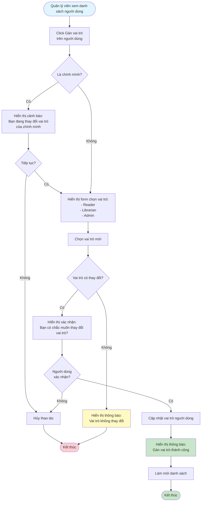

# 2.6.2 - Gán Vai Trò

## Mô tả
Tính năng cho phép quản lý viên gán vai trò cho người dùng trong hệ thống.

**Actor:** Quản lý viên  
**Yêu cầu:** Đăng nhập với vai trò quản lý viên

## Flowchart

## Vai Trò Trong Hệ Thống
- **Reader:** Chỉ có thể mượn sách, xem lịch sử cá nhân
- **Librarian:** Có thể quản lý sách, xác nhận mượn/trả, theo dõi phạt
- **Admin:** Toàn quyền, quản lý tài khoản, báo cáo, cài đặt

## Edge Cases
- Gán vai trò cho chính mình (cần cảnh báo)
- Vai trò không thay đổi (hiển thị thông báo)
- Thay đổi vai trò của người dùng đang hoạt động
- Gán vai trò Admin cho người dùng khác

