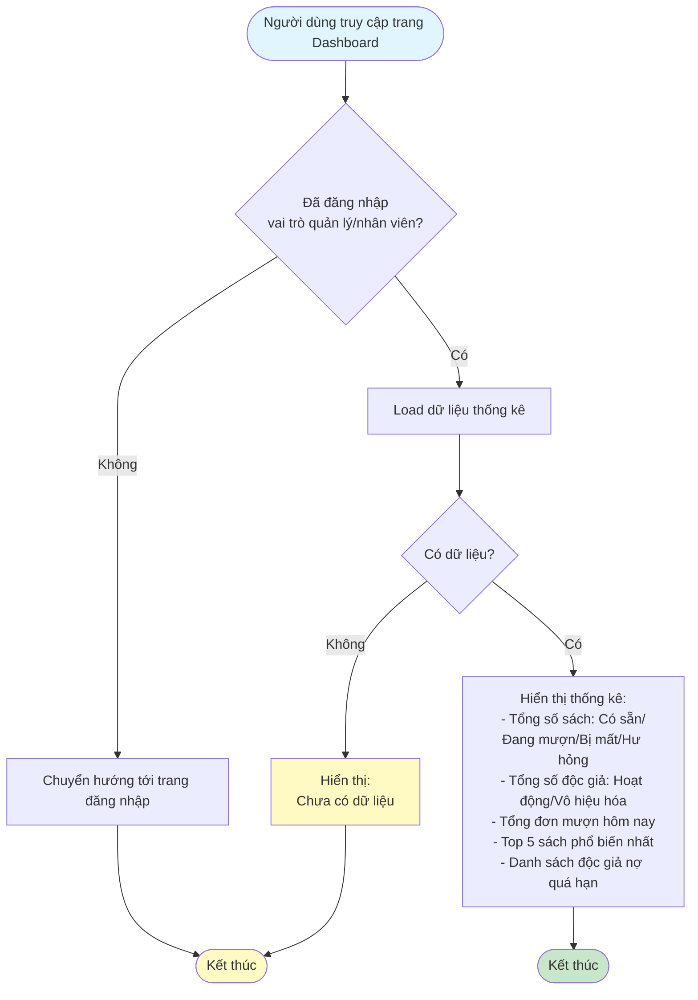

# 2.7.1 - Báo Cáo Tổng Quan (Dashboard)

## Mô tả
Tính năng hiển thị báo cáo tổng quan về tình trạng thư viện cho quản lý viên và nhân viên.

**Actor:** Quản lý viên, Nhân viên  
**Yêu cầu:** Đăng nhập với vai trò quản lý viên hoặc nhân viên

## Flowchart

## Hiển Thị Thông Tin

### Tổng số sách:
- Có sẵn
- Đang mượn
- Bị mất
- Hư hỏng

### Tổng số độc giả:
- Hoạt động
- Vô hiệu hóa

### Khác:
- Tổng đơn mượn hôm nay
- Top 5 sách phổ biến nhất
- Danh sách độc giả nợ quá hạn

## Edge Cases
- Dữ liệu rỗng (chưa có dữ liệu)
- Làm mới dữ liệu real-time
- Không có độc giả nợ quá hạn

