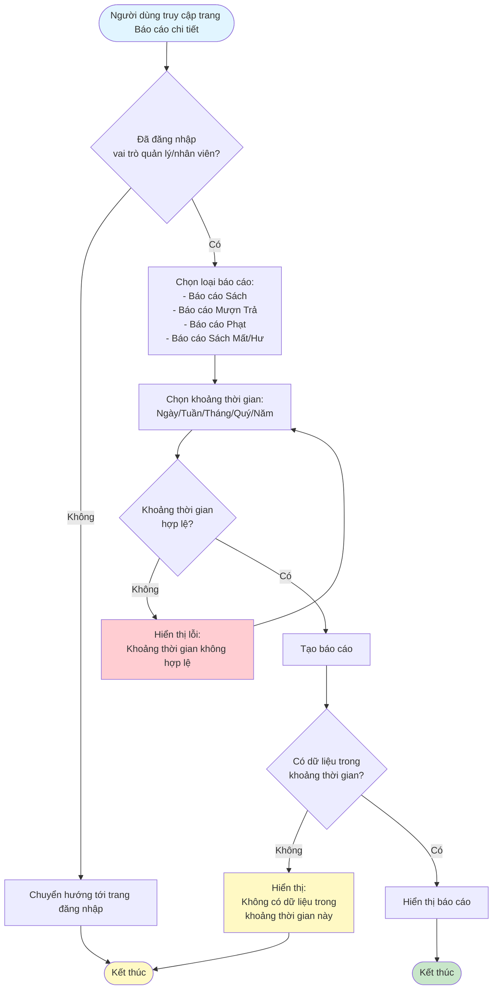
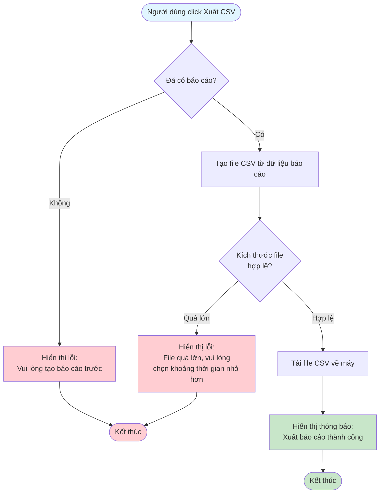

# 2.7.2 - Báo Cáo Chi Tiết

## Mô tả
Tính năng cho phép quản lý viên và nhân viên xem các báo cáo chi tiết và xuất ra file CSV.

**Actor:** Quản lý viên, Nhân viên thư viện  
**Yêu cầu:** Đăng nhập với vai trò quản lý viên hoặc nhân viên

## Flowchart - Xem Báo Cáo

## Flowchart - Xuất CSV

## Các Báo Cáo Có Sẵn

### 1. Báo cáo Sách:
- Tổng số sách
- Tình trạng sách
- Số lần mượn

### 2. Báo cáo Mượn Trả:
- Số lần mượn/trả theo ngày/tháng/quý

### 3. Báo cáo Phạt:
- Tổng doanh thu phạt
- Người nợ ngoài hạn

### 4. Báo cáo Sách Mất/Hư:
- Danh sách sách cần thay thế

## Tính Năng
- **Xuất báo cáo ra CSV**
- **Lọc theo khoảng thời gian:** Ngày, Tuần, Tháng, Quý, Năm

## Edge Cases
- Khoảng thời gian không hợp lệ
- Không có dữ liệu trong khoảng thời gian
- File CSV quá lớn
- Chưa tạo báo cáo khi xuất CSV

