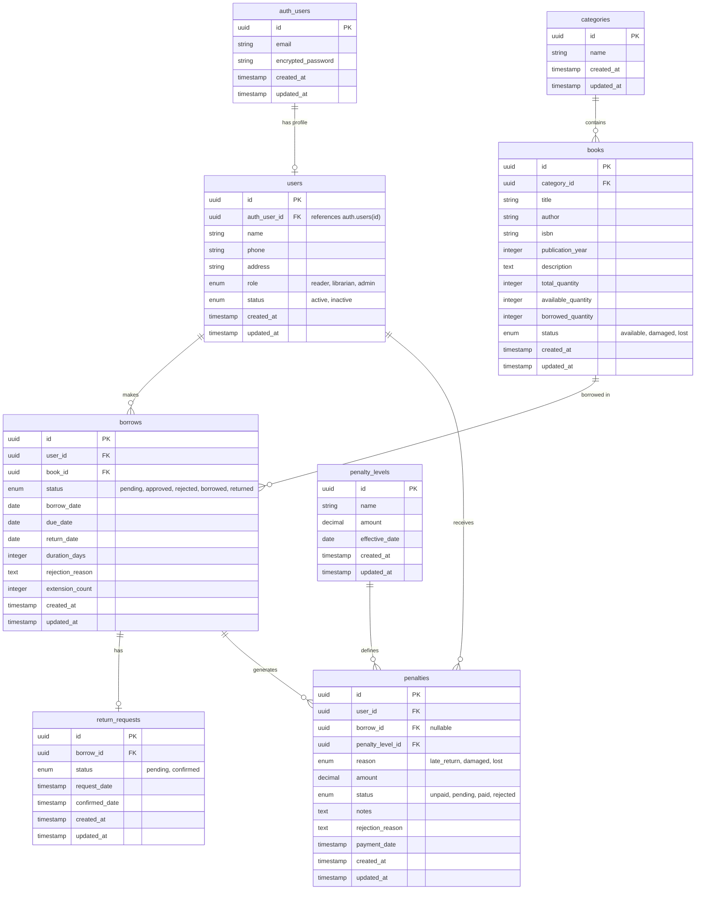

# Database Schema - Library Management System

## Entity-Relationship Diagram

## Table Descriptions

### users
User profiles extending Supabase Auth. Each user has a role (reader, librarian, admin) and status (active/inactive).

**Key Fields:**
- `auth_user_id`: Foreign key to `auth.users(id)`
- `role`: User role in the system
- `status`: Account status

### categories
Book categories for organizing the library collection.

**Key Fields:**
- `name`: Category name (max 50 characters)

### books
Books in the library collection.

**Key Fields:**
- `category_id`: Foreign key to categories
- `total_quantity`: Total copies owned
- `available_quantity`: Copies available for borrowing
- `borrowed_quantity`: Copies currently borrowed
- `status`: Physical condition status

### borrows
Borrowing records tracking book loans.

**Key Fields:**
- `user_id`: Reader who borrowed
- `book_id`: Book being borrowed
- `status`: Current state of the borrow (pending → approved/rejected → borrowed → returned)
- `duration_days`: Loan period in days (1-30)
- `extension_count`: Number of extensions (max 1)
- `rejection_reason`: Reason if rejected

### return_requests
Return requests initiated by readers.

**Key Fields:**
- `borrow_id`: Associated borrow record
- `status`: pending or confirmed
- Only one pending return request per borrow allowed

### penalty_levels
Configurable penalty amounts for different violation types.

**Key Fields:**
- `name`: Penalty level name (max 25 characters)
- `amount`: Penalty amount
- `effective_date`: When this penalty level becomes active

### penalties
Penalty records for violations (late return, damage, loss).

**Key Fields:**
- `user_id`: User who received the penalty
- `borrow_id`: Associated borrow (nullable for system penalties)
- `penalty_level_id`: Which penalty level applies
- `reason`: Type of violation
- `status`: Payment status
- `notes`: Librarian notes (required for damage/loss)
- `rejection_reason`: Reason if payment rejected

## Relationships

1. **users ↔ auth.users**: One-to-one (each auth user has one profile)
2. **users ↔ borrows**: One-to-many (user can have multiple borrows)
3. **users ↔ penalties**: One-to-many (user can have multiple penalties)
4. **categories ↔ books**: One-to-many (category can have multiple books)
5. **books ↔ borrows**: One-to-many (book can be borrowed multiple times)
6. **borrows ↔ return_requests**: One-to-one (each borrow can have one return request)
7. **borrows ↔ penalties**: One-to-many (borrow can generate multiple penalties)
8. **penalty_levels ↔ penalties**: One-to-many (penalty level can be used in multiple penalties)

## Indexes

### Performance Indexes
- `users(auth_user_id)`: Unique index for auth user lookup
- `users(role)`: For role-based queries
- `users(status)`: For filtering active/inactive users
- `books(category_id)`: For category filtering
- `books(status)`: For status filtering
- `books(title, author)`: Composite index for search
- `borrows(user_id)`: For user's borrow history
- `borrows(book_id)`: For book's borrow history
- `borrows(status)`: For status filtering
- `borrows(due_date)`: For overdue queries
- `return_requests(borrow_id)`: Unique index (one per borrow)
- `return_requests(status)`: For pending returns
- `penalties(user_id)`: For user's penalties
- `penalties(status)`: For unpaid/pending penalties
- `penalties(borrow_id)`: For borrow-related penalties

## Constraints

### Check Constraints
- `books`: `total_quantity >= 0`, `available_quantity >= 0`, `borrowed_quantity >= 0`
- `books`: `available_quantity + borrowed_quantity <= total_quantity`
- `borrows`: `duration_days BETWEEN 1 AND 30`
- `borrows`: `extension_count <= 1`
- `penalty_levels`: `amount > 0`
- `penalties`: `amount > 0`

### Unique Constraints
- `users(auth_user_id)`: One profile per auth user
- `books(isbn)`: Unique ISBN per book (if provided)
- `return_requests(borrow_id)`: One pending return request per borrow

## Row Level Security (RLS)

All tables have RLS enabled with policies for:
- **SELECT**: Users can view their own data; librarians/admins can view all
- **INSERT**: Users can create their own records; librarians/admins can create any
- **UPDATE**: Users can update their own data; librarians/admins can update any
- **DELETE**: Only librarians/admins can delete

